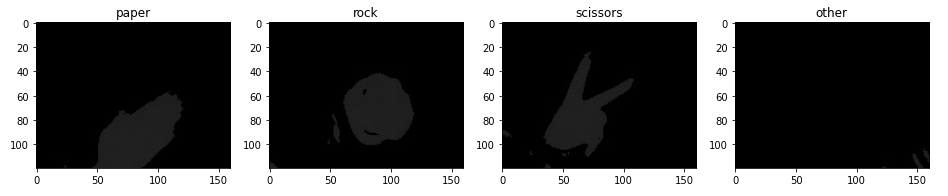
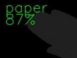
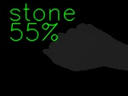
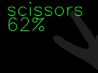

# Gesture recognition in thermal images

Repository contains source code for thermal camera laboratory advanced and additional task "paper, rock, scissors gesture recognition". Laboratory is part of "Introduction to Image Processing" (pl. "Wprowadzenie do Przetwarzania Obrazu") university subject at Poznan University of Technology.

## Dataset

"Paper, rock, scissors" thermal dataset consists of about 150 images for each class and the same quantity belongs to class other. The dataset is available online and can be downloaded from [Google Drive](https://drive.google.com/file/d/1uluuaLeg5TU1D-HFtc6fnO6B0tSpUMDq/view?usp=sharing).

<p align="center">
  
</p>

## Tasks description

Project consists of three steps: 
1. collect data,
2. train classification model,
3. check and evaluate trained model.
It is possible to skip task 1 and use prepared dataset.

### Collect dataset

In order to collect new data examples, one can use [`gesture_capture.py`](./gesture_capture.py) script which contains a pipeline for saving images for the specified category. 

Save keys are at the top of the script and by default are as follow:

```python
PAPER_KEY = 'p'
ROCK_KEY = 'r'
SCISSORS_KEY = 's'
OTHER_KEY = 'o'
```

Run script with command:

```bash
python3 gesture_capture.py
```

### Train classification model

For training SqueezeNet classification model one can use [Jupyter Notebook](./thermal_gesture_recognition.ipynb) and local machine or utilize online [Google Colab Notebook](https://colab.research.google.com/drive/1OteCMcXc9MRv2QWR44ZIZPhTMrI5n0c3?usp=sharing).

### Evaluate trained model

For evaluation purposes, the [`gesture_recognition.py`](./gesture_recognition.py) script was prepared. It takes as an input a path to model and ensures continuous classification of gestures in input thermal image. After training (and downloading model) run script with command:

```bash
python3 gesture_recognition.py --model_path <PATH TO MODEL>
```

Example results are presented below.

<p align="center">
  
  
  
</p>